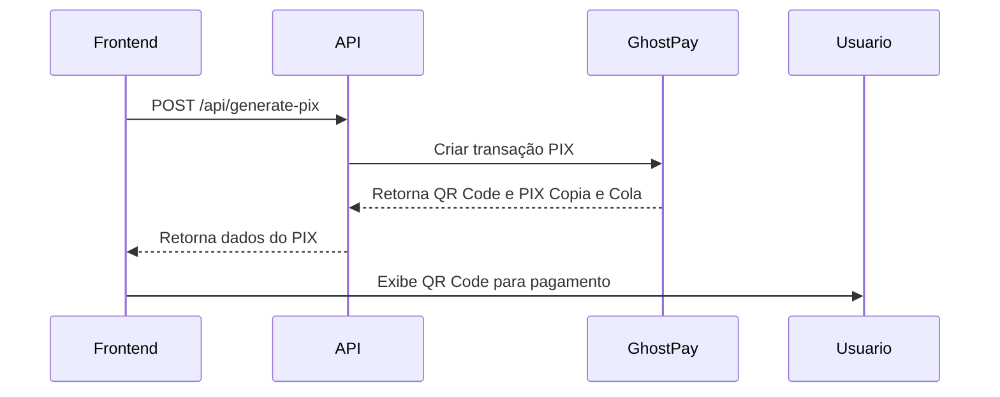

# 👻 Integração GhostPay - CNH Social 2025

Documentação completa da integração do gateway de pagamento GhostPay no projeto CNH Social 2025.

---

## 📋 Visão Geral

O GhostPay foi integrado como gateway de pagamento PIX alternativo ao Umbrela. A aplicação suporta múltiplos gateways e pode alternar entre eles através de variáveis de ambiente.

### Gateways Disponíveis:
- **GhostPay** (Padrão)
- **Umbrela** (Alternativo)

---

## 🔧 Configuração

### 1. Variáveis de Ambiente

Edite o arquivo `.env.local` (ou configure no servidor):

```env
# Gateway de Pagamento (ghostpay ou umbrela)
PAYMENT_GATEWAY=ghostpay

# Credenciais GhostPay
GHOSTPAY_API_KEY=sua-secret-key-aqui
GHOSTPAY_COMPANY_ID=sua-company-id-aqui

# Credenciais Umbrela (opcional - backup)
UMBRELA_API_KEY=sua-api-key-umbrela
```

### 2. Obter Credenciais GhostPay

1. Acesse o painel do GhostPay
2. Navegue até **Configurações** → **API**
3. Copie:
   - **Secret Key** (GHOSTPAY_API_KEY)
   - **Company ID** (GHOSTPAY_COMPANY_ID)

---

## 🚀 Endpoint da API

### POST `/api/generate-pix`

Endpoint para gerar PIX através do GhostPay ou Umbrela.

#### Request Body:

```json
{
  "amount": 2274,
  "customer": {
    "name": "João da Silva",
    "email": "joao@email.com",
    "phone": "11999999999",
    "document": {
      "number": "12345678900",
      "type": "cpf"
    }
  },
  "itemType": "recharge"
}
```

#### Response Success:

```json
{
  "success": true,
  "transactionId": "abc123xyz",
  "pixCode": "00020126580014br.gov.bcb.pix...",
  "qrCode": "data:image/png;base64,iVBORw0KGgo..."
}
```

#### Response Error:

```json
{
  "success": false,
  "error": "Mensagem de erro"
}
```

---

## 📡 Fluxo de Integração

### 1. Geração do PIX



### 2. Autenticação GhostPay

A API utiliza **Basic Authentication** com base64:

```typescript
const authString = Buffer.from(`${secretKey}:${companyId}`).toString('base64')

headers: {
  'Authorization': `Basic ${authString}`
}
```

### 3. Payload Enviado ao GhostPay

```json
{
  "amount": 2274,
  "paymentMethod": "pix",
  "customer": {
    "name": "João da Silva",
    "email": "joao@gmail.com",
    "phone": "11999999999",
    "document": {
      "number": "12345678900",
      "type": "cpf"
    }
  },
  "items": [
    {
      "title": "CNHSO - eBook eSport Digital Premium",
      "unitPrice": 2274,
      "quantity": 1,
      "tangible": false
    }
  ]
}
```

---

## 🔄 Alternância de Gateways

### Configurar Gateway Padrão

No arquivo `.env.local`:

```env
# Usar GhostPay
PAYMENT_GATEWAY=ghostpay

# OU usar Umbrela
PAYMENT_GATEWAY=umbrela
```

### Lógica de Seleção

```typescript
const gateway = process.env.PAYMENT_GATEWAY || 'ghostpay'

if (gateway === 'ghostpay') {
  result = await generatePixGhostPay(body, baseUrl)
} else if (gateway === 'umbrela') {
  result = await generatePixUmbrela(body, baseUrl)
}
```

---

## 🧪 Testes

### Teste Local (Desenvolvimento)

```bash
# 1. Configurar .env.local
PAYMENT_GATEWAY=ghostpay
GHOSTPAY_API_KEY=sua-chave-teste
GHOSTPAY_COMPANY_ID=sua-company-id-teste

# 2. Iniciar servidor
npm run dev

# 3. Testar endpoint
curl -X POST http://localhost:3000/api/generate-pix \
  -H "Content-Type: application/json" \
  -d '{
    "amount": 2274,
    "customer": {
      "name": "Teste",
      "phone": "11999999999",
      "document": {"number": "12345678900"}
    },
    "itemType": "recharge"
  }'
```

### Teste em Produção

```bash
curl -X POST https://seu-dominio.com/api/generate-pix \
  -H "Content-Type: application/json" \
  -d '{
    "amount": 2274,
    "customer": {
      "name": "Cliente Teste",
      "phone": "11999999999",
      "document": {"number": "12345678900"}
    }
  }'
```

---

## 📊 Logs e Monitoramento

### Logs no Console

A API gera logs detalhados:

```
👻 [GhostPay] Verificando autenticação:
  Secret Key: ✓ Presente
  Company ID: ✓ Presente
📤 [GhostPay] Gerando PIX - Valor: R$ 22.74
🚀 [GhostPay] Enviando requisição para API...
📡 [GhostPay] Status: 200
🔍 [GhostPay] DADOS EXTRAÍDOS:
  transactionId: abc123
  pixCode: 00020126...
✅ [GATEWAY] PIX gerado com sucesso!
```

### Verificar Logs no Servidor

```bash
# PM2
pm2 logs cnh-social

# Systemd
sudo journalctl -u cnh-social -f

# Netlify
Acessar Dashboard → Functions → Logs
```

---

## 🔒 Segurança

### Boas Práticas Implementadas:

1. **Credenciais em Variáveis de Ambiente**
   - Nunca commitar `.env.local`
   - Usar `.env.example` como template

2. **Validação de Dados**
   - Validação de campos obrigatórios
   - Sanitização de inputs

3. **Logs Seguros**
   - Não logar credenciais completas
   - Ocultar dados sensíveis (PIX Code truncado)

4. **HTTPS Obrigatório**
   - Produção sempre em HTTPS
   - Certificado SSL válido

---

## 🐛 Troubleshooting

### Erro: "GHOSTPAY_API_KEY não configurado"

**Solução:**
```bash
# Verificar se variáveis estão definidas
echo $GHOSTPAY_API_KEY
echo $GHOSTPAY_COMPANY_ID

# Adicionar ao .env.local
nano .env.local

# Reiniciar aplicação
pm2 restart cnh-social
```

### Erro: "Erro na API de pagamento: 401"

**Causa:** Credenciais inválidas

**Solução:**
1. Verificar Secret Key e Company ID no painel GhostPay
2. Confirmar que não há espaços extras nas variáveis
3. Testar credenciais diretamente na API do GhostPay

### Erro: "Erro na API de pagamento: 422"

**Causa:** Dados inválidos no payload

**Solução:**
1. Verificar formato do CPF (apenas números)
2. Verificar formato do telefone (DDD + número)
3. Validar email (formato válido)

### PIX não é gerado

**Checklist:**
- [ ] Variáveis de ambiente configuradas
- [ ] Gateway correto selecionado (PAYMENT_GATEWAY=ghostpay)
- [ ] Credenciais válidas
- [ ] Servidor reiniciado após mudanças
- [ ] Logs não mostram erros

---

## 📈 Comparação de Gateways

| Recurso | GhostPay | Umbrela |
|---------|----------|---------|
| Taxa de aprovação | Alta | Alta |
| Tempo de resposta | ~1-2s | ~1-2s |
| QR Code | ✅ Sim | ✅ Sim |
| PIX Copia e Cola | ✅ Sim | ✅ Sim |
| Webhook | ✅ Sim | ✅ Sim |
| Suporte | 24/7 | Horário comercial |

---

## 🔄 Migração de Gateway

### De Umbrela para GhostPay

1. **Obter credenciais GhostPay**
2. **Atualizar `.env.local`:**
   ```env
   PAYMENT_GATEWAY=ghostpay
   GHOSTPAY_API_KEY=sua-chave
   GHOSTPAY_COMPANY_ID=sua-company-id
   ```
3. **Testar em ambiente de desenvolvimento**
4. **Deploy em produção:**
   ```bash
   # Atualizar variáveis no servidor
   nano .env.local
   
   # Reiniciar aplicação
   pm2 restart cnh-social
   ```
5. **Monitorar logs por 24h**

### De GhostPay para Umbrela

1. **Atualizar `.env.local`:**
   ```env
   PAYMENT_GATEWAY=umbrela
   UMBRELA_API_KEY=sua-chave-umbrela
   ```
2. **Reiniciar aplicação**

---

## 📞 Suporte

### GhostPay
- **Documentação:** https://docs.ghostpay.com.br
- **Suporte:** suporte@ghostpay.com.br
- **WhatsApp:** (11) 99999-9999

### Projeto CNH Social
- **Logs:** `pm2 logs cnh-social`
- **Status:** `pm2 status`
- **Restart:** `pm2 restart cnh-social`

---

## ✅ Checklist de Deploy

- [ ] Variáveis de ambiente configuradas
- [ ] Credenciais GhostPay válidas
- [ ] Gateway selecionado (PAYMENT_GATEWAY)
- [ ] Teste local executado com sucesso
- [ ] Deploy realizado
- [ ] Teste em produção executado
- [ ] Logs monitorados
- [ ] Transação PIX testada end-to-end

---

**Integração concluída! Gateway GhostPay pronto para uso! 👻✅**
